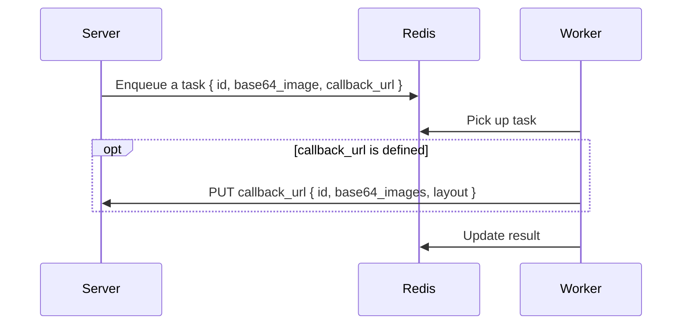

# How to use

## Dataflow



## Docker-compose

- Run worker with `celery` configs and call from your server.

```yml
version: '3'

services:
  redis:
    image: redis:latest

  server:
    build:
      dockerfile: Dockerfile
    command: python server.py
    environment:
      WORKER_BROKER_URL: redis://redis:6379/0
      WORKER_BACKEND_URL: redis://redis:6379/0
      WORKER_APP_NAME: worker
      WORKER_TASK_NAME: inference
    volumes:
      - ./:/app
    depends_on:
      - redis


  worker:
    image: ghcr.io/yushiang-demo/dula-net-worker:latest
    command: celery -A worker worker --loglevel=info
    environment:
      WORKER_BROKER_URL: redis://redis:6379/0
      WORKER_BACKEND_URL: redis://redis:6379/0
      WORKER_APP_NAME: worker
      WORKER_TASK_NAME: inference
    depends_on:
      - redis
```

## Helpers

- call worker from python

```python
import os
import io
import base64
from celery import Celery

# init celery
BROKER_URL = os.environ.get('WORKER_BROKER_URL')
BACKEND_URL = os.environ.get('WORKER_BACKEND_URL')
APP_NAME = os.environ.get('WORKER_APP_NAME')
TASK_NAME = os.environ.get('WORKER_TASK_NAME')
app = Celery(APP_NAME, broker=BROKER_URL, backend=BACKEND_URL)

# call celery
def run_task(img_base64, id, callback_url):
    app.send_task(TASK_NAME, args=[img_base64, id, callback_url])
```