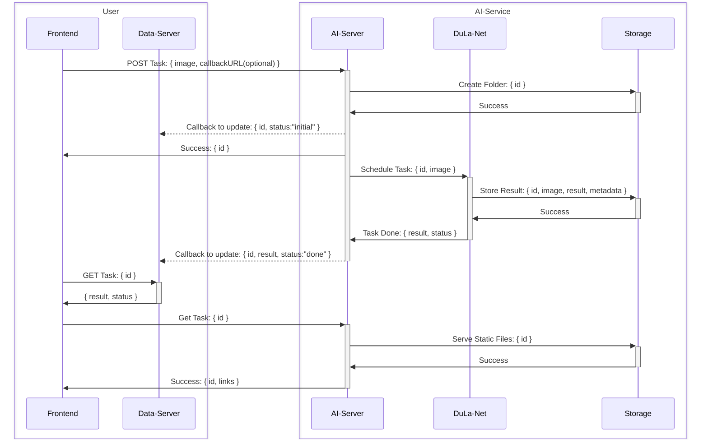

# APIs

## Quick start

- Start services `docker-compose up -d`
- Shutdown services `docker-compose down`
- Check services is alive `docker ps`
- Build Dockerfile if changed `docker-compose build`
- Get logs `docker-compose logs -f ${server, worker}`

## Workflow

Explore detailed information about the APIs in the Swagger UI documentation, accessible at http://localhost. The Swagger UI provides a comprehensive overview of the available APIs, including endpoints, methods, and detailed descriptions to assist you in understanding and interacting with the application.

In this repository, we've concentrated on building the AI service segment shown in the diagram below.

